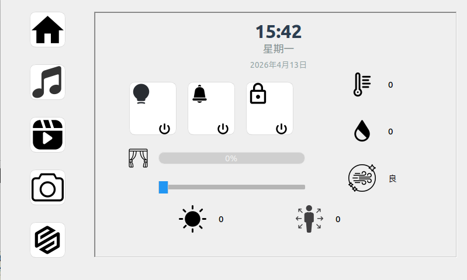

# imx6ull-SmartHome
基于正点原子imx6ull驱动课程学习实践项目

## 简介
本项目是学习正点原子驱动教程后完成的项目，使用 Qt5 构建 UI，集成多传感器监测、多媒体播放与 AI 语音控制。

## 功能特性
- 实时传感器监测：温湿度、光照、红外、距离、人体感应、空气质量
- 执行器控制：LED、蜂鸣器、继电器（门锁）、舵机（窗帘）
- 多媒体：音乐播放器、视频播放器、摄像头拍照
- AI 语音助手：语音识别（百度 ASR）→ 大模型理解（DeepSeek）→ 语音播报（百度 TTS）→ 控制硬件(开灯、开锁...)

## 依赖
- Qt 5.15（core / gui / widgets / multimedia / multimediawidgets）
- Linux 内核驱动（drivers文件下）
- 百度 AI 开放平台（ASR/TTS）账号
- 硅基流动 API 账号

## 环境要求
linux 4.1.15(kernel文件下)
buildroot根系统(https://pan.baidu.com/s/1H6AHNQFjd-KTvtZvuxqCDg?pwd=x51d)

## 界面预览

