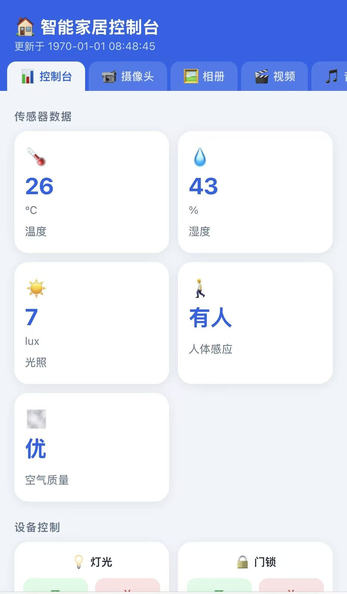

# imx6ull-SmartHome
基于imx6ull的智能家居系统

## 简介
本项目是学习正点原子驱动教程后完成的项目，使用 Qt5 构建本地UI，集成多传感器监测、多媒体播放与 AI 语音控制，内置 HTTP服务器提供网页远程控制家居。

## 功能特性
- 实时传感器监测：温湿度、光照、红外、距离、人体感应、空气质量
- 执行器控制：LED、蜂鸣器、继电器（门锁）、舵机（窗帘）
- 多媒体：音乐播放器、视频播放器、摄像头拍照/录像
- AI 语音助手：语音识别（百度 ASR）→ 大模型理解（DeepSeek）→ 语音播报（百度 TTS）→ 控制硬件(开灯、开锁...)
- 网页控制台：设备启动后通过网页访问 `http://<设备IP>:8080`，显示传感器数据，控制执行器，播放多媒体。

## 硬件环境

| 硬件 | 功能 |
|------|------|
| IMX6ULL（ARM Cortex-A7） | 主控 |
| DHT11 | 温湿度采集 |
| AP3216C | 环境光照采集 |
| SR501 | 人体红外感应 |
| MQ135 | 空气质量（ADC 电压） |
| USB 摄像头（UVC） | 拍照 / 录像 / 网页推流，640×480 YUY2 |
| LED / 蜂鸣器 / 继电器 / 舵机 | 执行器 |

## 项目结构

```
├── main.cpp
├── mainwidget.cpp/h         # 主窗口，管理页面切换和模块连接
├── form/                    # Qt UI 页面
│   ├── basicfunctions       # 基本功能页（时钟、天气等）
│   ├── camera               # 摄像头（拍照 / 录像 / 推流）
│   ├── musicplayer          # 音乐播放器
│   ├── videoplayer          # 视频播放器
│   └── aiassistant          # AI 助手
├── hardware/                # 硬件驱动
│   ├── hardwaremanager      # 统一硬件接口
│   ├── mq135                # 空气质量传感器
│   └── ...
├── library/                 # 后台服务
│   ├── httpserver           # HTTP 服务器（基于 QTcpServer）
│   ├── sensormonitor        # 传感器定时采集
|   └── ...
└── res/
    └── dashboard.html       # 网页控制台（单页应用）
```

## 依赖
- Qt 5.15（core / gui / widgets / multimedia / multimediawidgets）
- Linux 内核驱动（drivers文件下）
- 高德地图API 账号
- 百度 AI 开放平台（ASR/TTS）账号
- 硅基流动 API 账号

## 环境要求
linux 4.1.15(kernel文件下)
buildroot根系统(https://pan.baidu.com/s/1dBKruw95TAyEtGGHt04l5Q?pwd=2fm9)

## 界面预览




## 硬件引脚连接
| 模块 | 引脚 |
| :--- | :--- |
| SG90 舵机 | `gpio1_4` |
| DHT11 温湿度传感器 | `TAMPER2` |
| SR501 人体红外模块 | `gpio1_2` |
| JDQ 继电器 | `TAMPER5` |
| MQ135 空气质量传感器 | `gpio1_1` |

---

## 配置步骤

### 修改 API Key
编辑 `config.ini` 文件，填入你的 apikey


